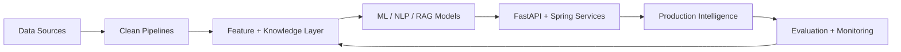

  

  

   
   

  
  
  

---

  

I am a **Data Scientist and AI Engineer** focused on turning data, models, and backend systems into intelligent products. My work connects scientific thinking with production-grade engineering: experimentation, evaluation, data pipelines, APIs, deployment, and continuous improvement.

> **Core direction:** applied AI, measurable data products, reliable ML systems, and clean software delivery.

**Scientific Thinking**

`model evaluation` `NLP` `retrieval quality` `recommendation systems` `deep learning experiments`

**Engineering Execution**

`FastAPI services` `Spring Boot backends` `Docker workflows` `Linux tooling` `clean APIs`

**Data Foundation**

`data orchestration` `analytics layers` `dbt transformations` `pipeline reliability` `big-data design`

---

  

- Building **AI-powered operational intelligence platforms**
- Improving **RAG pipelines, retrieval quality, and LLM evaluation**
- Designing **machine learning systems that are explainable, testable, and deployable**
- Open to collaboration on **AI, NLP, analytics, and data engineering projects**

---

  

   
   

  

   
   

  
  
  
  
  

   

  
  
  
  
  

---

  

**2026 priorities:** stronger retrieval, reliable ML workflows, analytics-ready data products, production observability, and useful AI automation.

---

  

   
   

  

   
   

  

   
   

  
  

   
   

  
  

---

  <strong>Building practical intelligence with data science, clean engineering, and curiosity.</strong>

   
   

  

